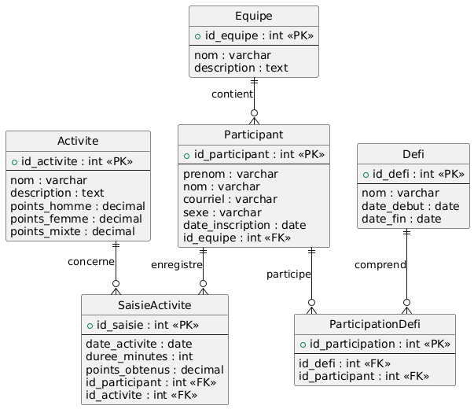

# Défi Santé

## Présentation (Buts et objectifs)

Le projet Défi santé vise à encourager les membres d'une communauté (une école, une entreprise, un groupe quelconque) à développer et à maintenir de saines habitudes de vie, notamment par la  pratique de l’activité physique. Le projet fait également la promotion d’une saine alimentation et encourage les gens à adopter un bon équilibre de vie.

Le projet se présente sous forme d'un **défi compétitif et amical** à réaliser en communauté pendant une période fixée de quelques semaines (10 par exemple).   Des équipes de 1 à 4 personnes sont formées.

Les équipes s'engagent à accumuler le plus de points "Défi Santé" possibles à travers les activités physiques disponibles chaque semaine.   Une liste précise des activités physiques est disponible pour le défi.  Chaque activité physique permet d'accumuler un certain nombre de *points* "Défi santé".  Dépendant du type d'activité, de la période de l'activité (nombres de minutes) et de l'intensité (faible, moyenne ou intense), le nombre de points gagnés peut varier.  Cela est déterminé par un tableau de pondération (voir plus bas).

Le nombre de points de chaque membre d'une équipe est additionné chaque semaine pour fournir le pointage de l'équipe.  Le but des équipes est évidemment d'accumuler le plus de points "Défi santé" pour la période du défi.

A la fin de la période du défi, l'équipe gagnante (celle qui a accumulé le plus de points) est déterminé.

### Liste des activités physiques avec pondération

Voici un exemple de la pondération des activités autorisées pour le défi.

| Activité            | Points Homme | Points Femme | Points Mixte |
| ------------------- | ------------ | ------------ | ------------ |
| badminton           | 3.6          | 6.4          | 8            |
| course / jogging    | 4.8          | 5.8          | 6.4          |
| danse aérobie       | 4.4          | 4.8          | 6            |
| elliptique appareil | 5.8          | 6.4          | 7.2          |
| escaliers           | 4.8          | 5.6          | 6.4          |
| golf                | 2.8          | 3.2          | 4.4          |
| hockey              | 7.2          | 7.2          | 7.2          |
| arts martiaux       | 6.4          | 7.2          | 8.8          |
| marche              | 2.4          | 3.6          | 4.8          |
| zumba               | 4.4          | 4.8          | 6            |
| ...                 | ...          | ...          | ...          |

Un ensemble de 172 activités sont déjà répertoriés avec leur pondération déterminé par des professionnels de l'activité physique.  

Les points mixtes (dernière colonne ci-haut) servent à standardiser la valeur d’une activité lorsqu’on ne veut pas distinguer le sexe.

### Modèle possible de la base de données

Pour fournir un aperçu de la complexité du projet, voici un modèle entité/relation de la base de données.  Le modèle pourrait être bonifié.

### Statistiques des données cumulées

Chaque semaine, il est intéressant de consulter des statistiques de l'avancement des participants et des équipes sous différents angles.  Voici d'autres données cumulées intéressantes à rendre disponibles tout au long du défi:

* Total des points par participant
* Total des minutes d’activité par participant
* Nombre d’activités réalisées par participant
* Total des points par équipe
* Moyenne de points par membre d’une équipe
* Total des points par type d’activité
* Nombre total d’activités saisies
* Répartition par sexe

## Projet numérique (résultats attendus et contraintes)

Pour soutenir le projet Défi Santé, il serait intéressant de développer des outils numériques permettant aux participants et aux organisateurs de sauvegarder les données de façon cohérente et rapide.

Le projet numérique serait alors de créer 2 applications (à partir de zéro):

1. Un API *Back-end* écrit en **Flask (Python)** complet permettant de gérer l'ensemble des données sauvegardés dans une base de données **PostgreSQL**;
2. Un application Web ou mobile (*Front-end*) qui sera utilisé par les participants et les organisateurs.  Le choix de la technologie n'est pas fixée.  Il est suggéré d'utiliser *Flutter* mais une autre technologie est possible.

L'API devra fournir un niveau de sécurité approprié.  Il faudra qu'une configuration OpenAPI / Swagger pour la spécification des routes et la documentation interactive. L'application *Front-end* devra être fonctionnel, convivial et robuste.  Des comptes participants et gestionnaires devront être intégrés et permettent des interfaces de gestion différentes.

Pour pouvoir tester l'API, il faudra fournir un `docker-compose.yml` adaptée pour exécuter le code localement sur les postes de travail.  Si possible, il faudrait la même chose pour l'application *Front-end*.

## Premières étapes de développement

1. Projet "Hello World" API Flask, dépôt sur Github
2. Projet "Hello World" Front-end, dépôt sur Github
3. Création Docker-compose.yml API Flask
4. Création Docker-compose.yml Front-end
5. Premier Pull-request pour tester
6. Développement de la première fonctionnalité API Flask
7. Développement de la première fonctionnalité Front-end
8. Pull-request API Flask
9. Pull-request Front-end
10. ...

